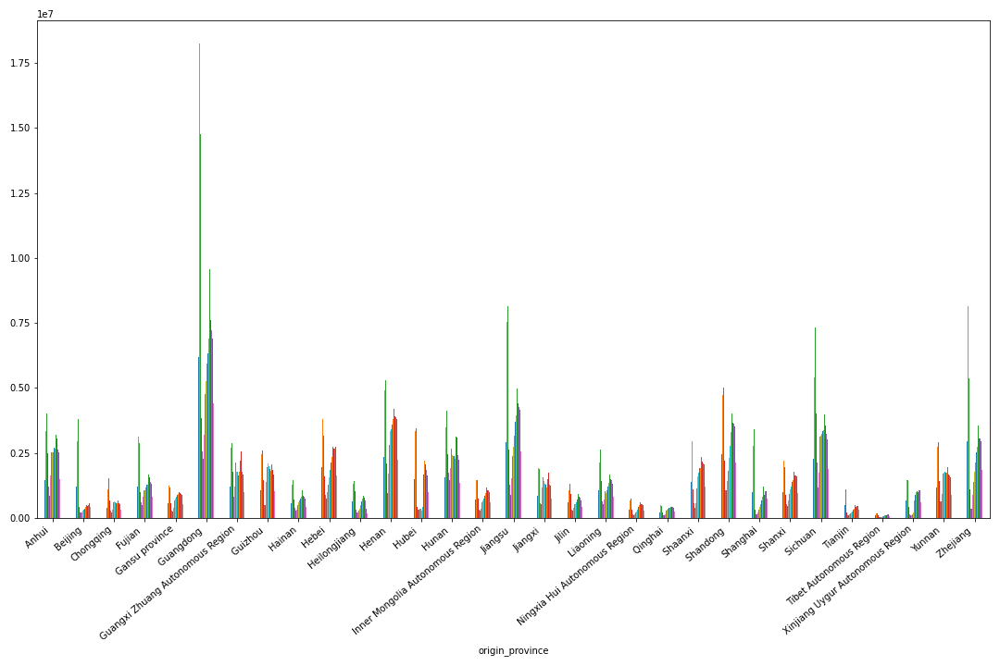
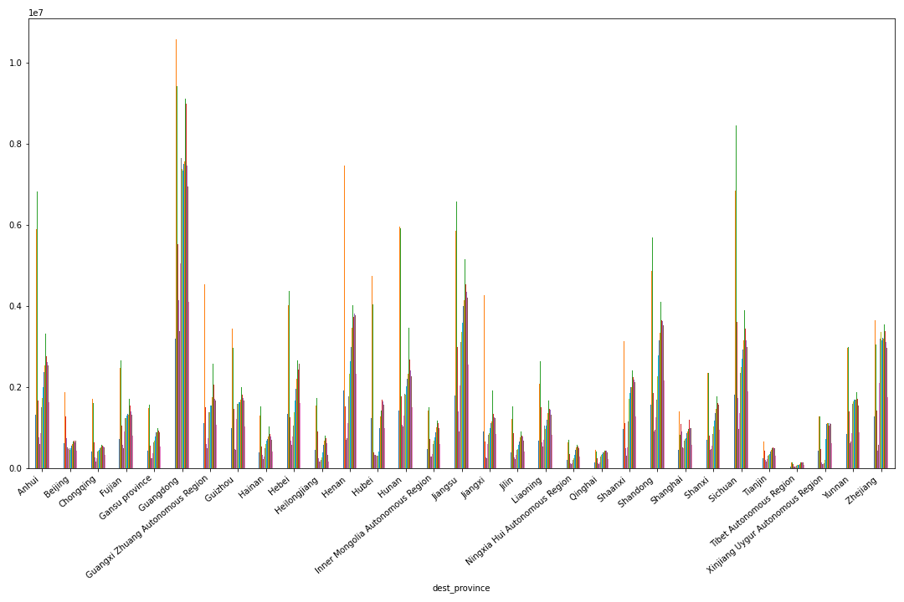
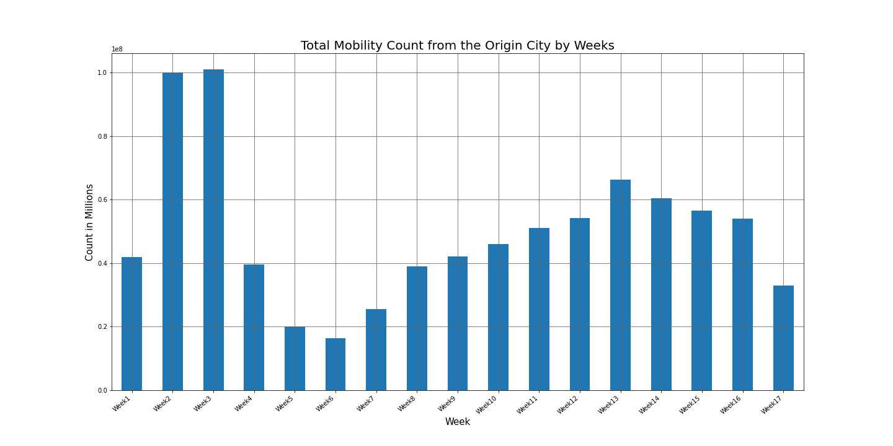

# Mobility Patterns in China During Covid-19 Pandemic
To seek the dominant spatial and longitudinal trends in long-distance spring-festival travel among 356 prefectural cities in China during covid-19 lockdown period in comparison to 2019.

#### Data description

* The data consists of Origin and Destination which includes;
Origin city name, Origin city id, Origin Province, Origin Longitude, Origin Latitude
Destination city name, Destination city id, Destination Province, Destination Longitude, Destination Latitude

* It also has mobility data which is a number of trips each day for 112 days. Each column represents a date. The data is from January 10th to April 30th.

Preliminary analysis of the spatial data in this project has provided insights in the movement before and during the lock down due to covid-19. Weekly aggregated data shows a significant drop in mobility during the week after 26th January till March second week.
Following are some visualizations to show the preliminary trends,

 

](https://www.youtube.com/watch?v=hhkuNjh3SZE)