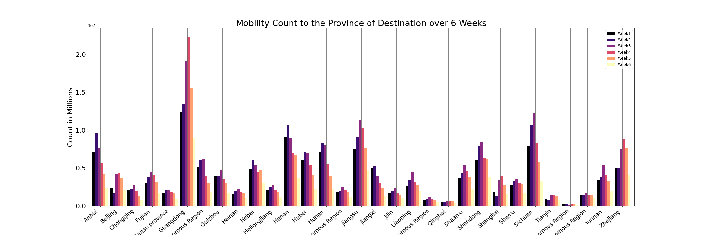

# Mobility Patterns in China During Covid-19 Pandemic

To seek the dominant spatial and longitudinal trends in long-distance spring-festival travel among 356 prefectural cities in China during covid-19 lockdown period in comparison to 2019.

#### Data description

* The data consists of Origin and Destination which includes;
Origin city name, Origin city id, Origin Province, Origin Longitude, Origin Latitude
Destination city name, Destination city id, Destination Province, Destination Longitude, Destination Latitude

Analysis of the spatial data in this project has provided insights in the movement before and during the lock down due to covid-19 compared to similar data a year ago. 

 

